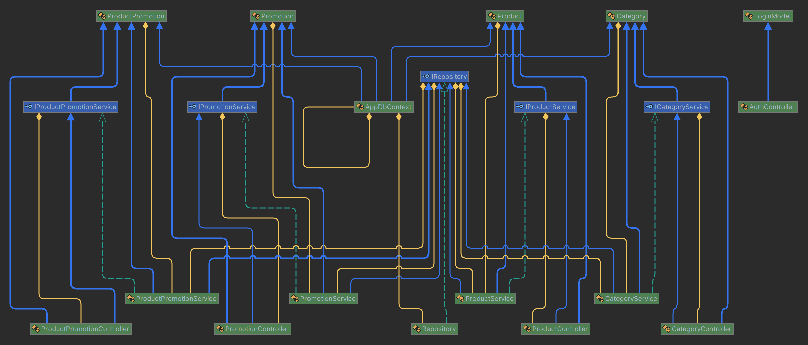
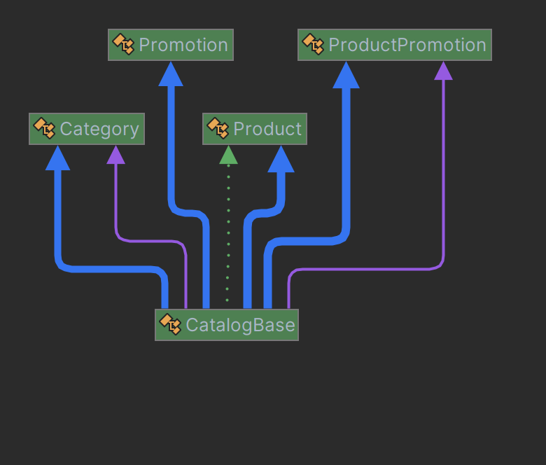

# Architecture et Conception

## Architecture du projet

Le projet est composé de 4 parties :

- Le Frontend, qui est l'interface utilisateur, développé avec Blazor WebAssembly
- Le Backend, qui est composé d'une API REST, développé avec ASP.NET Core 8.0
- La base de données, qui est une base de données relationnelle, développé avec PostgreSQL
- Le projet est hébergé sur plusieurs services de Microsoft Azure

Le projet est donc structuré avec une architecture microservices, ce qui permet d'avoir une application plus modulaire et plus facile à maintenir.

## Frontend

Le frontend est développé avec **Blazor WebAssembly**, qui est une technologie de Microsoft permettant de développer des applications web avec C# et Razor.   
Blazor a pour avantage de "remplacer" JavaScript par C# et Razor, ce qui permet d'avoir un code plus propre et plus facile à maintenir, tout en ayant une application web dynamique.   

## Backend

Le backend est développé avec **ASP.NET Core 8.0**, qui est un framework de Microsoft permettant de développer des applications web avec C#.
J'ai choisi ASP.NET Core pour rester dans l'écosystème Microsoft, et pour avoir une application web complète avec un seul langage de programmation.
Le service API est sur un serveur différent du frontend, ce qui permet d'avoir une application plus modulaire et plus facile à maintenir.

## Base de données

La base de données est une base de données relationnelle, développé avec **PostgreSQL**.
J'ai choisi PostgreSQL car c'est une base de données open source, et que j'ai déjà eu l'occasion de travailler avec.

## Hébergement

Le projet est hébergé sur plusieurs services de **Microsoft Azure**.

- Le frontend et le backend sont hébergés sur **Azure Web Apps**, qui est un service permettant d'héberger des applications web.
- La base de données est hébergé sur **Azure Database for PostgreSQL**, qui est un service permettant d'héberger des bases de données PostgreSQL.

## Choix techniques

J'ai choisi Blazor WebAssembly pour le frontend car c'est une technologie de Microsoft qui m'intéresse beaucoup, et qui permet de développer des applications web avec C# et Razor.
J'ai choisi ASP.NET Core pour le backend afin de rester dans l'écosystème Microsoft, et pour avoir une application web complète avec un seul langage de programmation.

## Conception

### Diagramme de classes

### API

### Web app

