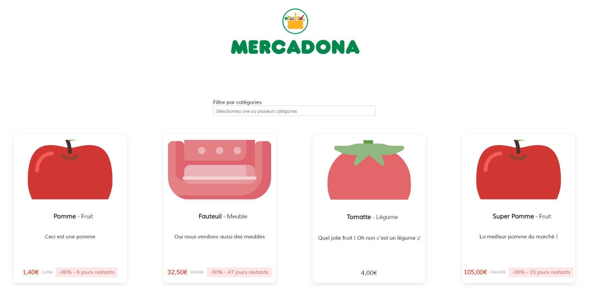

# Catalogue

Sur la page principale du magasin (le catalogue) on y retrouve la liste complète des produits de la société **Mercadona**

## Filtres

Vous avez la possibilité de filtrer les produits par catégorie. Vous pouvez ajouter plusieurs filtres en même temps.

## Cartes produits

Voici un détail de chaque carte qui représente les produits :

La carte change légèrement une fois qu'une promotion a été appliqué au produit, ajoutant le pourcentage de remise ainsi que le nouveau prix calculé.

## Administrateur

Si vous êtes connecté en tant qu'administrateur, vous aurez accès à certaines fonctionnalités en plus.

### Ajouter un produit

Vous aurez la possibilité d'ajouter un nouveau produit en cliquant sur `Ajouter un produit` à côté du filtre, ce qui ouvrira un formulaire à remplir.

Dans la sélection d'une catégorie, vous pouvez aussi entrer une nouvelle catégorie afin de l'ajouter dans la base de données.

### Ajouter une promotion

Vous aurez également la possibilité d'ajouter une nouvelle promotion, il suffit de cliquer sur `Ajouter une promotion` en bas de la carte du produit. 
Si une promotion existe déjà, un bouton `Modifier la promotion` sera alors affiché afin de mettre à jour la promotion.

Dans la sélection d'une nouvelle promotion, vous pouvez aussi entrer une nouvelle valeur afin de l'ajouter dans la base de données.
La valeur est un entier de 0 à 100 représentants le pourcentage. Vous devrez également mettre une date de début et de fin.
