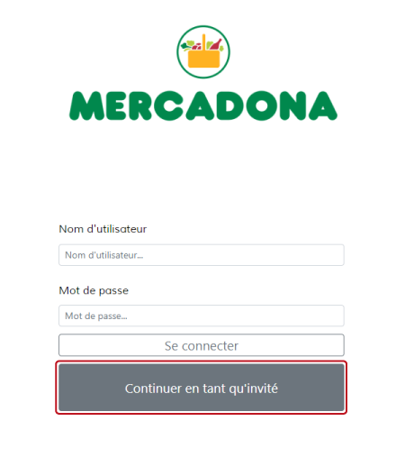
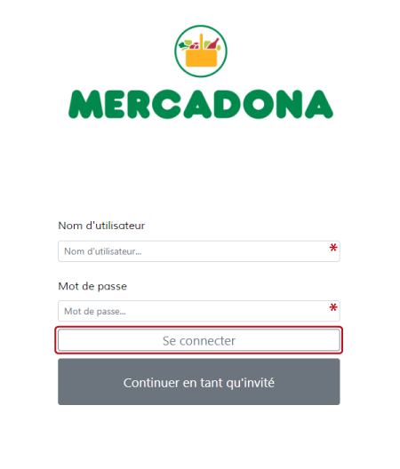

# Page d'accueil

## Visiteurs

Un visiteur n'a pas besoin de se connecter, il pourra directement cliquer sur `Continuer en tant qu'invité`

## Administrateur

Un administrateur devra entrer son nom d'utilisateur ansi que son mot de passe puis cliquer sur `Se connecter`   
Pour des questions pratiques dans ce projet, un seul compte administrateur a été créé, il vous faudra donc entrer ces identifiants :
- Nom d'utilisateur : `root`
- Mot de passe : `manager`

