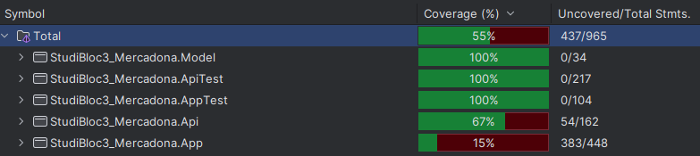

# Tests unitaires

## Introduction

Les tests unitaires sont des tests qui permettent de vérifier le bon fonctionnement d'une unité de code. Une unité de code peut être une fonction, une classe, un module, etc. Les tests unitaires sont généralement écrits par les développeurs eux-mêmes, et sont exécutés à chaque fois que le code est modifié. Ils permettent de s'assurer que les modifications apportées n'ont pas cassé le code existant.

## Tests unitaires dans le projet

Dans le projet, j'ai utilisé le framework de tests **xUnit**. Ce framework permet de créer des tests unitaires en C# et de les exécuter.
Tous les tests sont séparés dans un projet à part.

### Tests sur l'API

Pour l'API, il était important de tester :

- Le contexte de la base de données
- Les contrôleurs
- Les services

### Tests de la WebApp

Pour la WebApp, il était important de tester :

- Les services

## Exemple de tests

Voici quelque exemple de tests unitaires que j'ai réalisés dans le projet :

```c#
[Fact]
public async Task GetAll_ReturnsAllProducts()
{
    var mockService = new Mock<IProductService>();
    mockService.Setup(service => service.GetAllProductsAsync())
        .ReturnsAsync(new List<Product> { new(), new() });

    var controller = new ProductController(mockService.Object);

    var result = await controller.GetAll();

    var products = Assert.IsAssignableFrom<IEnumerable<Product>>(result);
    Assert.Equal(2, products.Count());
}
```

```c#
[Fact]
public async Task GetAllProductsAsync_ReturnsAllProducts()
{
    var mockRepo = new Mock<IRepository<Product>>();
    mockRepo.Setup(repo => repo.GetAllAsync())
        .ReturnsAsync(new List<Product> { new(), new() });

    var service = new ProductService(mockRepo.Object);

    var result = await service.GetAllProductsAsync();

    Assert.NotNull(result);
    Assert.Equal(2, result.Count());
}
```

```c#
private AppDbContext CreateDbContext()
{
    var options = new DbContextOptionsBuilder<AppDbContext>()
        .UseInMemoryDatabase(databaseName: Guid.NewGuid().ToString())
        .Options;

    return new AppDbContext(options);
}
```

```c#
[Fact]
public async Task GetAllProductsAsync_ReturnsAllProducts()
{
    var products = new List<Product> { new(), new() };
    _mockHttp.When(HttpMethod.Get, "/api/Product/GetAll")
        .Respond("application/json", JsonConvert.SerializeObject(products));

    var service = new ApiProductService(_mockHttpClient);

    var result = await service.GetAllProductsAsync();

    Assert.Equal(2, result.Count);
}
```

## Couverture de tests

La couverture de tests est un indicateur qui permet de savoir si le code est bien testé et si les tests sont pertinents. 
Pour cela, j'ai utilisé Jetbrains Rider qui me permet de voir la couverture des tests de mon projet.

